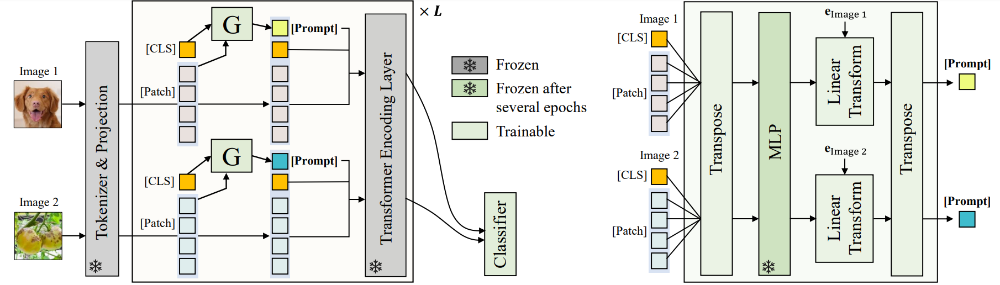

# Generating Instance-level Prompts for Rehearsal-free Continual Learning
This is the official PyTorch implementation for "[Generating Instance-level Prompts for Rehearsal-free Continual Learning](https://openaccess.thecvf.com/content/ICCV2023/papers/Jung_Generating_Instance-level_Prompts_for_Rehearsal-free_Continual_Learning_ICCV_2023_paper.pdf)" [ICCV 2023 ORAL].

# Abstract
We introduce Domain-Adaptive Prompt (DAP), a novel method for continual learning using Vision Transformers (ViT). Prompt-based continual learning has recently gained attention due to its rehearsal-free nature. Currently, the prompt pool, which is suggested by prompt-based continual learning, is key to effectively exploiting the frozen pre-trained ViT backbone in a sequence of tasks. However, we observe that the use of a prompt pool creates a domain scalability problem between pre-training and continual learning. This problem arises due to the inherent encoding of group-level instructions within the prompt pool. To address this problem, we propose DAP, a pool-free approach that generates a suitable prompt in an instance-level manner at inference time. We optimize an adaptive prompt generator that creates instance-specific fine-grained instructions required for each input, enabling enhanced model plasticity and reduced forgetting. Our experiments on seven datasets with varying degrees of domain similarity to ImageNet demonstrate the superiority of DAP over state-of-the-art prompt-based methods.



# Requirements

Our experiments are done with:

- python 3.8
- pytorch 1.11.0
- tensorflow 2.5.0
- numpy 1.23.4
- fvcore 0.1.6
- tensorflow_datasets 4.9.2
- scipy 1.10.1
- ml-collections 0.1.1

# Environment setup
```
conda create -n [ENV_NAME] python=3.8
conda activate [ENV_NAME]
bash env_setup.sh
```

# Data preparation
- The datasets should be located in the 'dataset' folder (CIFAR-100, Oxford-IIIT Pets, EuroSAT, RESISC45, CropDiseases, ISIC, ChestX, ImageNet-R, and DomainNet) 
- For [Pets](https://www.robots.ox.ac.uk/~vgg/data/pets/), [CropDiseases](https://www.frontiersin.org/articles/10.3389/fpls.2016.01419/full), [ISIC](https://challenge.isic-archive.com/landing/2018/47/), and [ChestX](https://openaccess.thecvf.com/content_cvpr_2017/papers/Wang_ChestX-ray8_Hospital-Scale_Chest_CVPR_2017_paper.pdf), we transform each dataset into TFDS compatible form following the tutorial in [link](https://www.tensorflow.org/datasets/add_dataset) to cover the CL scenario (see sec. 5 and supp. A for details). 
- For the rest of the datasets, you can directly download them from tensorflow_datasets. 
- TFDSs of experimented benchmarks can be downloaded at [Google Drive](https://drive.google.com/drive/folders/1bBqS8MuTQXUBV3DXJ_-YZyNOR4ejvm1O?usp=sharing)

# Pretraiend ViT model
- The pretrained ViT-B/16 checkpoint should be located in the 'model' folder.
- ViT-B/16 model used in the paper can be downloaded at [Google Drive](https://drive.google.com/drive/folders/1bBqS8MuTQXUBV3DXJ_-YZyNOR4ejvm1O?usp=sharing)

# Run experiments
```
CUDA_VISIBLE_DEVICES=0 python train.py [--config-file]
```
For example for SplitCIFAR-100, execute
```
CUDA_VISIBLE_DEVICES=0 python train.py --config-file configs/dap/cifar.yaml
```
 
# Acknowledgement

This repository is based on the official PyTorch implementation of "[Visual Prompt Tuning](https://github.com/KMnP/vpt)" [ECCV 2022].

# License

Licensed under [CC BY-NC 4.0](LICENSE)

```
dap-cl
Copyright (c) 2023-present NAVER Cloud Corp.
CC BY-NC-4.0 (https://creativecommons.org/licenses/by-nc/4.0/)
```

# How to cite
```
@inproceedings{jung2023generating,
  title={Generating Instance-level Prompts for Rehearsal-free Continual Learning},
  author={Jung, Dahuin and Han, Dongyoon and Bang, Jihwan and Song, Hwanjun},
  booktitle={Proceedings of the IEEE/CVF International Conference on Computer Vision},
  pages={11847--11857},
  year={2023}
}
```

